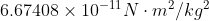
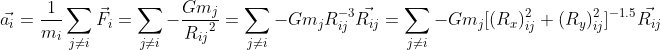

# gravity-simulation

This project is a simulation of the solar system I created.

## Formulas
For a closed n-bodies system, the net gravitational force exert on object *i* is
<br/><br/>

<br/>
where  and  are the masses of object *i* and *j*,  is the gravity constant,  is the relative position vector between object *i* and object *j*
<br/>
And hence, object *i* accelerates at 
<br/><br/>
 
<br/><br/>
Once we have the acceleration, we can approximate the velocity and hence, position of that object *i* at each time step *t* with the time duration  
between every iteration
<br/><br/> 

<br>

<br/><br/>
## More details 

I initialize the position and velocity as follows:
<br/><br/>

<br/>

<br/>
where  and  are the distance from the Sun's center and the orbital velocity of the planets obtained from [NASA planetary fact sheet](https://nssdc.gsfc.nasa.gov/planetary/factsheet/). I chose  randomly in the range . The initial acceleration doesn't matter because I recompute it at every timestep in the for loop. 
<br/><br/>
The orbital velocity of the sun is 
<br/>
 
<br/>so that the total momentum of the system is zero and the reference frame is the center of mass's.
<br/><br/>
Note that during visualization, I plotted the sun and planets as markers with size propotional to the log of their relative diameters (as the their relatives diameters are very disproportionate to each other):
<br/>

<br/>

## Installation & Run

- If you haven't already, you should install ```matplotlib``` with the command
```pip install matplotlib```
Or if you are using Anaconda, then it is 
```conda install -c conda-forge matplotlib```

- Open terminal/git bash and clone the repository:
```git clone https://github.com/pkien01/gravity-simulation```
- Finally, run the script: ```python3 solar_system_simulator.py```

## Demo
Here is the result:
<br/>

<br/><br/><br/>
I hope you enjoy it!

